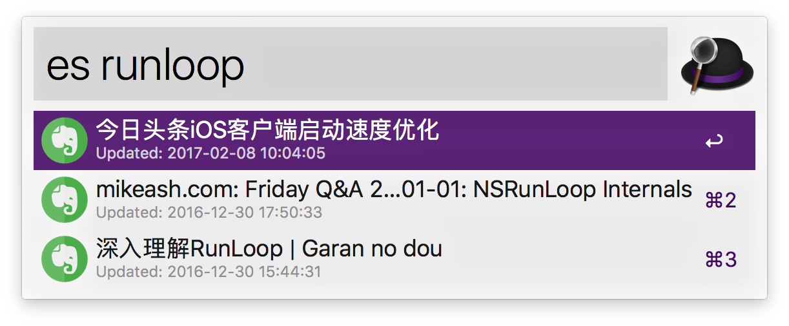
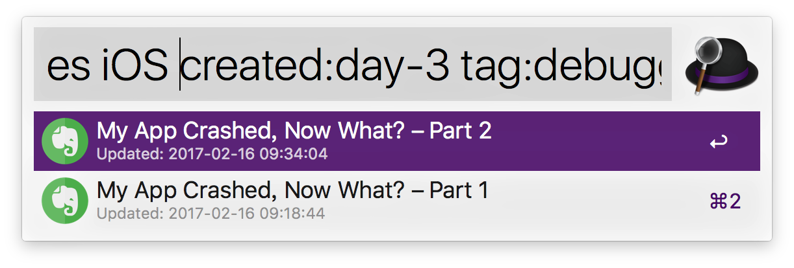

# 印象笔记搜索 - Alfred 3 workflow

本 workflow 使用了[印象笔记 API](https://dev.yinxiang.com/doc/) 来进行笔记搜索，可以提供比桌面应用更加精准的搜索。同时，此 workflow 还支持印象笔记的[所有高级搜索语法](https://dev.yinxiang.com/doc/articles/search_grammar.php)。

## 效果

使用**关键字**进行搜索

使用**标签**进行搜索

高级搜索语法（搜索最近 3 天内创建、标签为 `debugging` 同时包含关键字 `iOS` 的笔记）。更多的高级搜索语法，请[参考印象笔记官网](https://dev.yinxiang.com/doc/articles/search_grammar.php)

## 使用方法

1. 下载并安装本 workflow
2. 在 Alfred 中运行 `es-token` 进行 token 配置
3. 在 Alfred 中运行 `es` 命令进行搜索
4. 尝试各种高级搜索语法和其它命令，如 `es-todos`，`es-recent`

## 备注

所有搜索到的笔记都可以直接使用印象笔记直接打开，也可以配合 `cmd` 键在浏览器中打开笔记。

## 自定义搜索命令

创建自定义搜索命令也很简单，只需做如下步骤：

1. 复制一个 `es-search-shortcut-template` 触发器模板
2. 打开新复制的触发器，并按照其中的指令进行操作
3. 完成！

## 参考

* [alfred-evernote](https://github.com/shaoshing/alfred-evernote)
